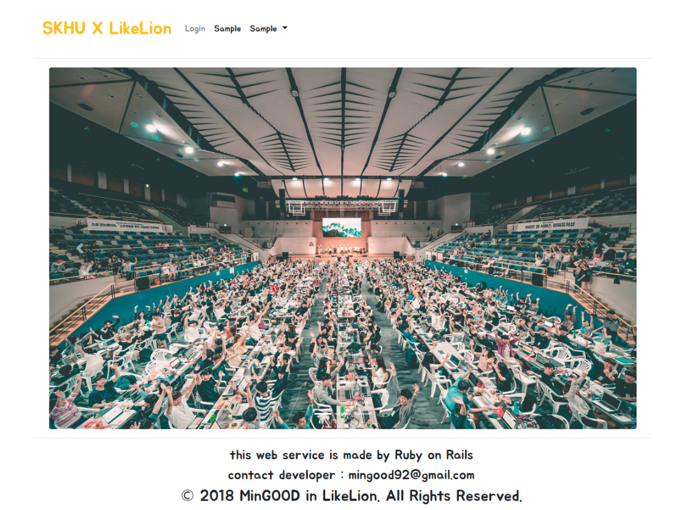
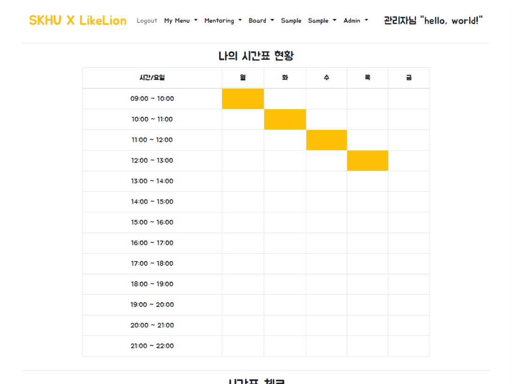

# Software Mentoring System
* 기능 정리 - [Function](https://github.com/MinGOODdev/Rails-Software-Mentoring/wiki/Function)
* API 정리 - [API Manual](https://github.com/MinGOODdev/Rails-Software-Mentoring/wiki/API-Manual)

---

## 실행화면

---

---

---

---

---

---

---

---

## TODO
설명 | 진행 상황
-----|----
보고서 다운로드 시 파일 이름에 학기도 포함시키기 | V
멘토 권한은 멘티 신청을 할 수 없게 하기 | V 
멘티 신청 선착순 처리 | V
체크박스 전체선택 기능 추가하기 | Not yet
시간 설정해서 그 시간에 멘토 신청, 멘티 신청 On/Off 하기 | Not yet 
Mentoring End 하면 관리자 아이디 빼고 권한 다 2로 만들기 | V
if문 중첩 3개 이상 case-when으로 바꾸기 | V
삭제를 할 경우에는 한번 더 확인하기 | Not yet
파일 업로드할 때 선택된 파일 없으면 버튼 안 보이게 하기 (AJAX?) | Not yet

---

## Author
* 조민국